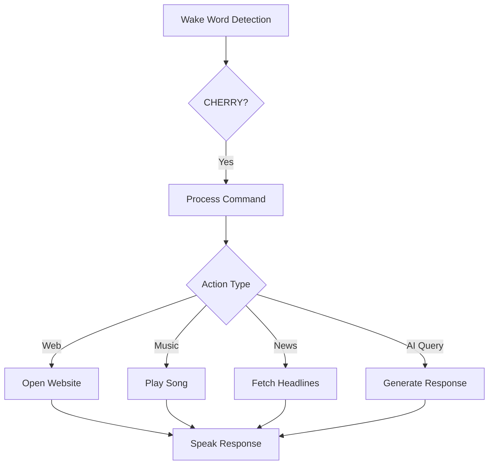

# 🎙️ **CHERRY - Your Voice-Activated Virtual Assistant** 🚀  

)  
*AI-Powered Personal Assistant.*  

---

## 🌟 **Overview**  
**CHERRY** is a voice-activated virtual assistant that performs tasks like web browsing, playing music, fetching news, and answering questions using OpenAI's GPT-3.5-turbo model.  

---

## 🛠️ **Core Features**  

✅ **Voice Recognition**  
   - Wake word: **"CHERRY"**  
   - Listens and responds intelligently.  

🎧 **Text-to-Speech**  
   - Speaks responses using `pyttsx3` (offline) or `gTTS` (online).  

🌐 **Web Browsing**  
   - Opens Google, YouTube, Facebook, and LinkedIn with simple voice commands.  

🎵 **Music Playback**  
   - Plays songs from your music library or web links.  

📰 **News Updates**  
   - Fetches the latest headlines using **NewsAPI**.  

🧠 **OpenAI Integration**  
   - Intelligent responses powered by **GPT-3.5-turbo**.  

---

## ⚙️ **How It Works**  



---

## 🚀 **Getting Started**  

1. **Clone Repository:**  
   ```bash
   git clone https://github.com/yourusername/jarvis-assistant.git
   cd jarvis-assistant
   ```  

2. **Install Dependencies:**  
   ```bash
   pip install -r requirements.txt
   ```  

3. **Run JARVIS:**  
   ```bash
   python main.py
   ```  

---

## 📂 **Project Structure**  
```plaintext
JARVIS/
├── main.py
├── modules/
│   ├── web.py
│   ├── music.py
│   └── news.py
├── config.py
├── README.md
└── requirements.txt
```

---

## 💡 **Tech Stack**  
- **Languages:** Python  
- **APIs:** OpenAI, NewsAPI  
- **Libraries:**  
  - `speech_recognition` 🎙️  
  - `pyttsx3` / `gTTS` 🔊  
  - `pygame` 🎶  

---


🚀 **Enhance your productivity with JARVIS!** 🤖  
